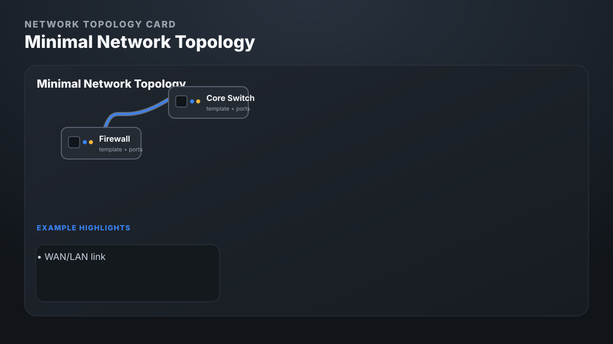
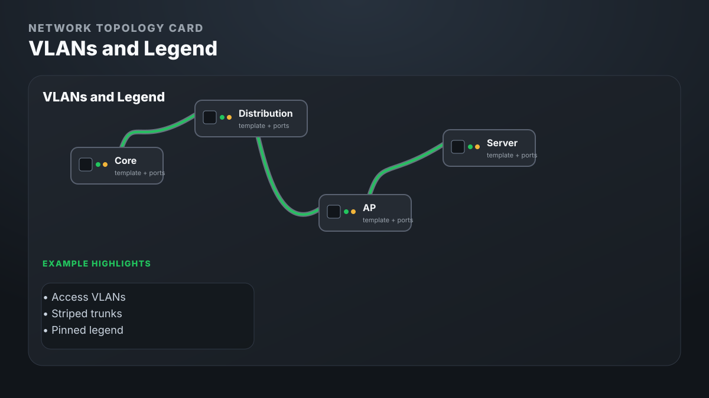
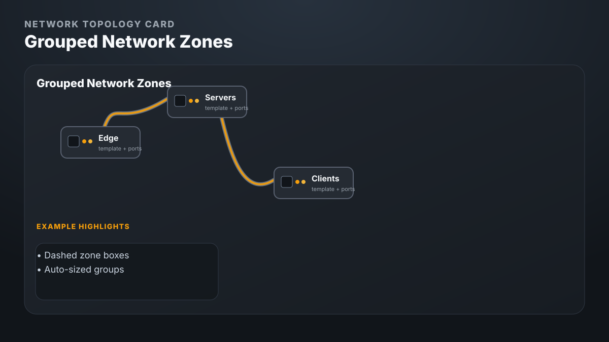
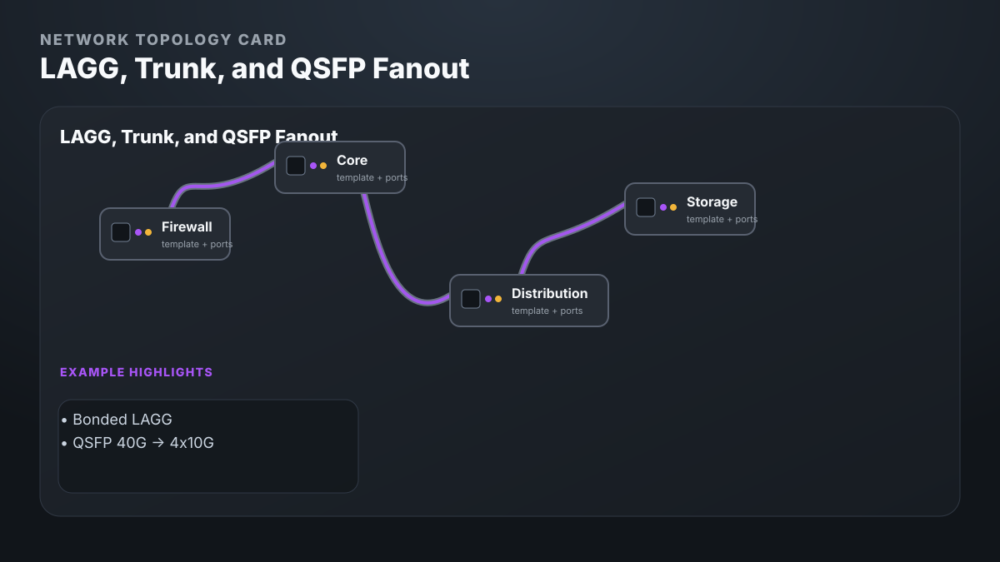
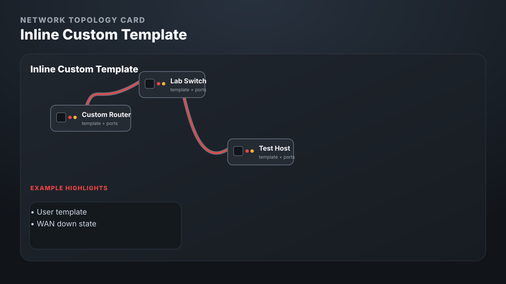
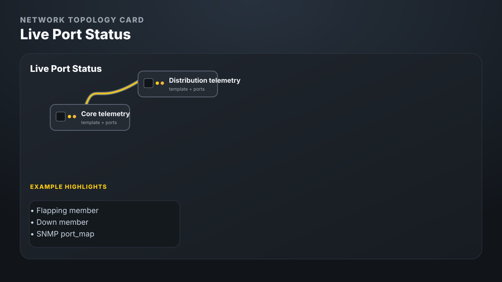
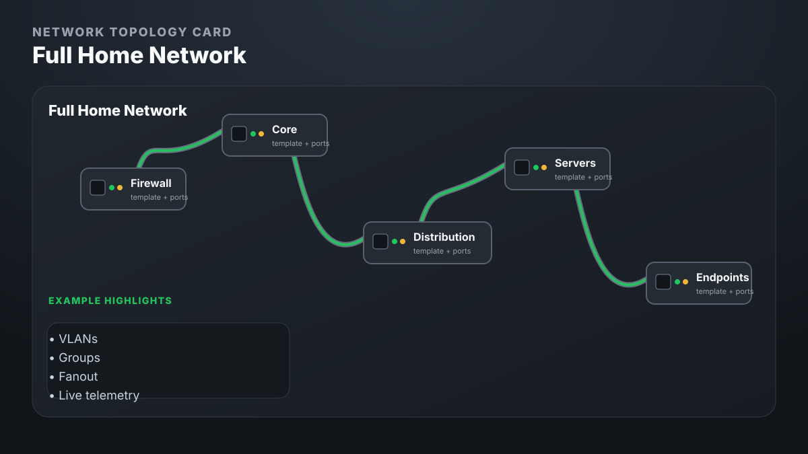

# Network Topology Card

[](https://hacs.xyz/)
[](https://github.com/biscuitWizard/network-topology-card)

A custom Home Assistant Lovelace card that renders a front-on network topology using composited SVG device chassis, per-port LEDs, VLAN coloring, group boxes, and routed links for single cables, LAGG/bond groups, trunks, and QSFP fanout.

This repository is the dashboard card distribution for HACS. Optional live SNMP polling is provided by the companion integration: [biscuitWizard/network-topology-snmp](https://github.com/biscuitWizard/network-topology-snmp).

## Gallery

Each image links to the dashboard YAML that produced it.

| Minimal | VLANs + Legend |
| --- | --- |
| [](examples/01-minimal.yaml) | [](examples/02-vlans-legend.yaml) |

| Groups | LAGG / Trunk / Fanout |
| --- | --- |
| [](examples/03-groups.yaml) | [](examples/04-lagg-trunk-fanout.yaml) |

| Custom Template | Live Status |
| --- | --- |
| [](examples/05-custom-template.yaml) | [](examples/06-live-status.yaml) |

| Full Showcase |
| --- |
| [](examples/99-full-home-network.yaml) |

The committed SVG previews are lightweight and render on GitHub without extra tooling. To regenerate browser-captured PNG screenshots from the real card renderer, run `npm run screenshots`; PNG files are written to `images/examples/*.png`.

## Features

- Composite SVG rendering: chassis artwork plus RJ45, SFP+, and QSFP+ port symbols with status LEDs.
- Built-in templates for Cisco Catalyst 4500-X, HP FlexFabric 5700, Intel NUC N150, and generic small/1U/2U/4U devices.
- Inline custom templates for your own device layouts.
- Link types `link`, `lagg`, and `trunk`, with zipped member pairing.
- QSFP breakout routing with `fanout: qsfp40g-to-4x10g`.
- VLAN-colored access ports, striped trunks, VLAN-aware cable coloring, and an optional legend.
- Tinted group boxes for racks, zones, VLANs, or logical stacks.
- Drag to pan, scroll to zoom, and reset view from the header.
- Optional live status for `up`, `down`, `disabled`, and `flapping` ports through Home Assistant entities or the SNMP companion integration.

## What You Configure

The card is intentionally data-driven:

- `templates` define reusable device models: chassis dimensions, chassis SVG key, and port coordinates.
- `devices` place template instances onto the canvas with names, management IPs, VLAN membership, telemetry sensors, and per-device scale.
- `links` connect ordered endpoint ports; LAGG/trunk members are paired by index, and QSFP fanout maps four SFP+ lanes to one QSFP+ cage.
- `vlans` and `legend` color ports and cables so access links, trunks, and multi-VLAN paths are legible.
- `groups` draw rack/zone/VLAN boxes behind related devices.
- `layout` controls padding, global scale, and cable curvature.

## Quickstart

Install the card, add it as a dashboard resource if needed, then create a manual card:

```yaml
type: custom:network-topology-card
title: Core Network
layout:
  padding: 90
  device_scale: 1
  link_curvature: 0.45

vlans:
  - { id: 1, name: Management, color: "#3b82f6" }
  - { id: 10, name: Servers, color: "#22c55e" }
legend:
  show: true
  position: top-right

devices:
  - id: router
    template: nuc-n150
    name: Router
    mgmt_ip: 10.0.0.2
    x: 0
    y: -240
    vlans:
      SFP0: trunk
      SFP1: trunk

  - id: core
    template: cisco-4500x
    name: Core Switch
    mgmt_ip: 10.0.0.10
    x: 0
    y: 0
    vlans:
      "1": trunk
      "2": trunk

groups:
  - id: core-zone
    name: Core
    vlan: 1
    devices: [router, core]

links:
  - id: lagg0
    name: LAGG0
    type: lagg
    state: up
    endpoints:
      - { device: router, ports: [SFP0, SFP1] }
      - { device: core, ports: ["1", "2"] }
```

## Installation

Use HACS as a custom plugin repository:

```text
https://github.com/biscuitWizard/network-topology-card
```

Manual install is also supported by copying `dist/network-topology-card.js` to Home Assistant's `www` directory and adding it as a module resource:

```yaml
resources:
  - url: /local/network-topology-card.js?v=20260606-1
    type: module
```

Bump the `?v=` query string whenever you replace the file so Home Assistant and the browser do not keep serving a cached module. See [Installation](docs/installation.md).

The built `dist/network-topology-card.js` file is self-contained with Lit and all SVG assets bundled.

## Examples

Start with one of the included examples and replace the device positions, management IPs, VLANs, and links with your own topology:

- [Minimal card](examples/01-minimal.yaml) - two devices and one simple link.
- [VLANs and legend](examples/02-vlans-legend.yaml) - access VLANs, all-VLAN trunks, subset trunks, and a pinned legend.
- [Groups](examples/03-groups.yaml) - dashed zone boxes for edge, server, and client segments.
- [LAGG, trunk, and fanout](examples/04-lagg-trunk-fanout.yaml) - bonded members plus QSFP 40G to 4x10G breakout.
- [Custom template](examples/05-custom-template.yaml) - inline template authoring for a device model that is not built in.
- [Live status](examples/06-live-status.yaml) - `telemetry_entity` and `port_map` wiring for the SNMP companion integration.
- [Full home network](examples/99-full-home-network.yaml) - the complete showcase with VLANs, groups, fanout, and telemetry.

## Documentation

- [Installation](docs/installation.md)
- [Configuration](docs/configuration.md)
- [Templates](docs/templates.md)
- [Live Status](docs/live-status.md)
- [Development](docs/development.md)
- [Troubleshooting](docs/troubleshooting.md)

## Live SNMP Status

Static configs work without any integration. For live switch status, install the companion [Network Topology SNMP integration](https://github.com/biscuitWizard/network-topology-snmp), then set `telemetry_entity` and `port_map` on switch devices:

```yaml
devices:
  - id: core
    template: cisco-4500x
    telemetry_entity: sensor.core_switch_ports
    port_map:
      "1": Te1/1
      "2": Te1/2
```

Status precedence is telemetry, then member/link entity, then static state, then default `up`. See [Live Status](docs/live-status.md).

## Development

```bash
npm install
npm run dev
npm run screenshot
npm run screenshots
npm run typecheck
npm run build
```

`npm run dev` serves the standalone rendering harness. `npm run screenshot` captures the default dev topology. `npm run screenshots` captures every example through `dev/example.html`. `npm run typecheck` validates TypeScript. `npm run build` writes the bundled HACS/manual-install artifact to `dist/network-topology-card.js`.
